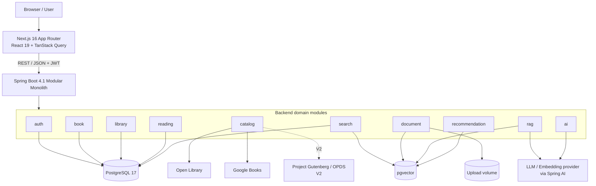
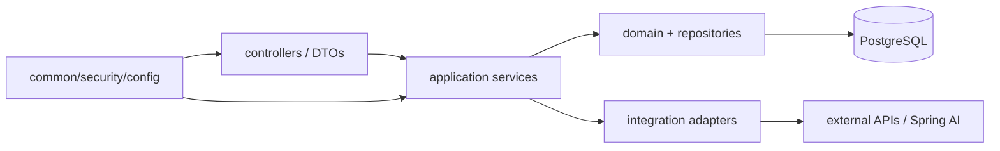
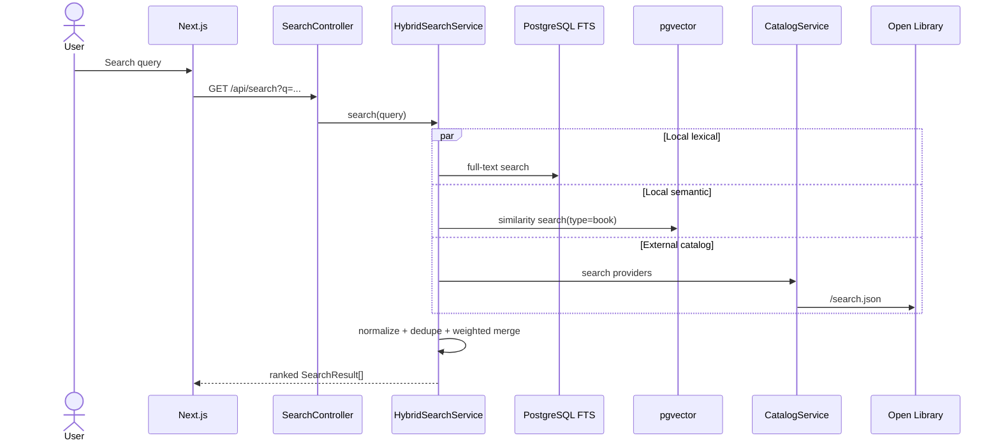
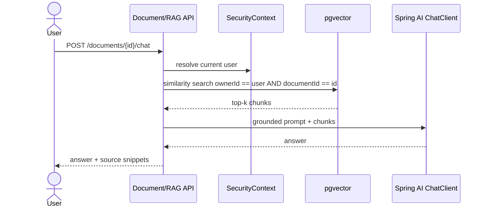

# Architecture

## Runtime architecture

## Backend package dependency rule

The project is **not** a textbook clean-architecture implementation. Packages are grouped by business capability; each module owns its controller, service, repository and domain types. Cross-module calls happen through application services, not by reaching directly into another module's tables where avoidable.

## Main request flows

### Catalog search

### Document RAG

## Deployment shape

The MVP has exactly three runtime containers:

1. `frontend`
2. `backend`
3. `postgres` with pgvector

Uploaded source files live in a Docker volume for local development. Production should replace this with object storage (S3-compatible) without changing the document module contract.
