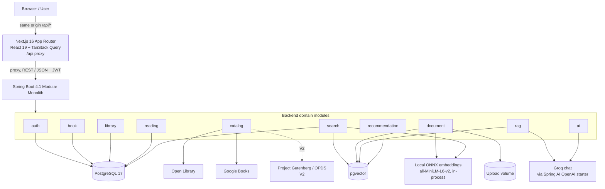
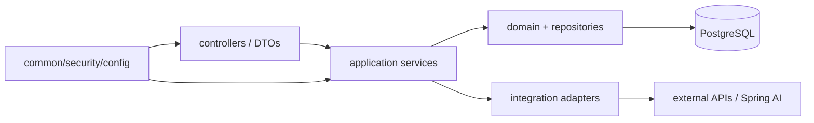
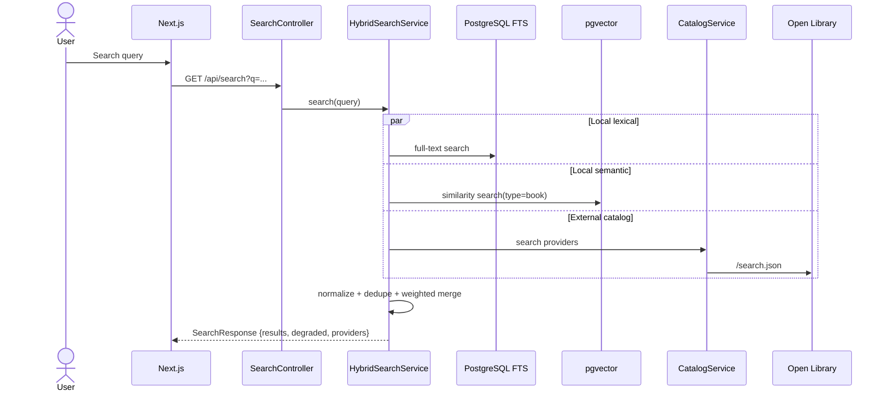
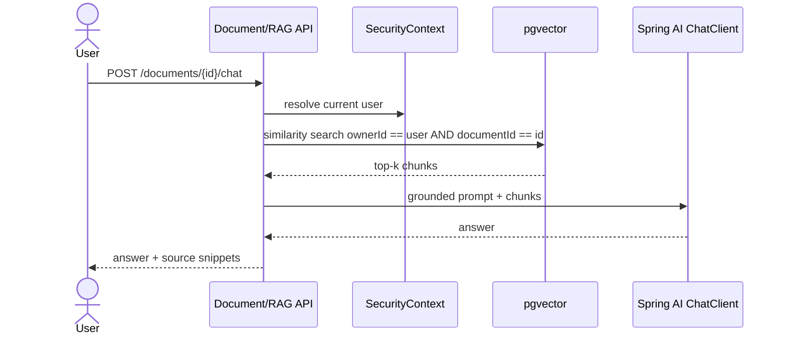

# Architecture

## Runtime architecture

## Backend package dependency rule

The project is **not** a textbook clean-architecture implementation. Packages are grouped by business capability; each module owns its controller, service, repository and domain types. Cross-module calls happen through application services, not by reaching directly into another module's tables where avoidable.

## Main request flows

### Catalog search

The three branches run in parallel on virtual threads with per-branch timeouts (lexical 2 s, semantic 2 s,
external 3 s). A branch that fails or times out is listed in `degraded`; each external provider reports `ok` in
`providers`. External results are cached for 5 minutes only when every provider answered.

### Document RAG

## Rules that hold across modules

- **No network or model call inside `@Transactional`.** LLM calls, embedding computation and catalog requests run
  outside transactions; writes around them use short transactions (for example catalog import, summaries,
  ingestion). AI request logs are written with `REQUIRES_NEW` so a failed request is still recorded.
- **Every private query is owner-scoped.** Controllers never take an owner id from the client; vector filters for
  private chunks always include `ownerId` (`VectorFilters`).
- **Rules that span modules have one home.** Shelf status ↔ reading progress rules live in `LibraryService`.
- **Errors use one envelope** (`ApiError` with an `ErrorCode`), including 401/403 from the security layer.

## Deployment shape

The MVP has exactly three runtime containers:

1. `frontend`
2. `backend`
3. `postgres` with pgvector

The browser only talks to the frontend origin: `src/proxy.ts` forwards `/api/*` to `API_INTERNAL_URL` at runtime, so
no CORS is needed in the default setup. Uploaded source files and the embedding model cache live in Docker volumes
for local development. Production should replace this with object storage (S3-compatible) without changing the document module contract.
