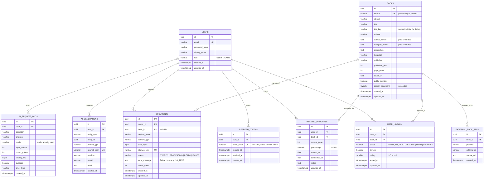

# Domain Model and Database

Generated from the Flyway migrations (`V1` core schema, `V2` triggers and hash column types, `V3` 384-dim embeddings
with jsonb metadata, `V4` normalized title key). Keep this file in sync when adding a migration.

## ERD



`updated_at` columns are maintained by a trigger (`set_updated_at`, V2) as well as by the application.
Deleting a user cascades to refresh tokens, shelf items, progress and document rows; the application also removes
uploaded files, vector rows and AI logs/generations (`AccountDeletionService`).

## Vector storage

MVP uses Spring AI's PostgreSQL vector store table rather than separate physical vector tables per feature.

```sql
vector_store (id uuid PK, content text, metadata jsonb, embedding vector(384))
```

Each document chunk row carries metadata such as:

```json
{
  "type": "document_chunk",
  "ownerId": "uuid",
  "documentId": "uuid",
  "bookId": "uuid-or-absent",
  "chunkIndex": 12,
  "sourceName": "clean-architecture.pdf"
}
```

Book metadata vectors use `type=book` and `bookId`. Vector ids are deterministic UUIDs (per book, per
document + chunk index), so re-indexing replaces rows instead of duplicating them.

### Why not a generic Embedding JPA entity?

The vector store already owns persistence/index semantics. Duplicating vectors into a JPA entity would create two sources of truth. Domain tables store business data; `vector_store` stores retrieval documents.

## Important indexes

- `users(email)` unique.
- `books(isbn13)` unique where not null; `books(isbn10)`; `books(title_key)`; `books(created_at desc)`.
- `books.search_document` GIN (full-text search).
- `external_book_refs(provider, external_id)` unique.
- `user_library(user_id, book_id)` unique; `user_library(user_id, status)`.
- `reading_progress(user_id, book_id)` unique.
- `documents(owner_id, created_at desc)`.
- `vector_store.embedding` HNSW cosine index.
- `vector_store.metadata` GIN `jsonb_path_ops` — matches the `metadata::jsonb @@ jsonpath` filters Spring AI emits.

### Filtered HNSW search

pgvector applies metadata filters after the HNSW scan. With `hnsw.iterative_scan = relaxed_order` (set by V3 for
the database and by the Hikari connection init SQL) the scan continues until enough rows pass the owner filter, so a
user with few chunks still gets results when other users have thousands (`FilteredRetrievalRecallIT`).
Requires pgvector ≥ 0.8 (the `pgvector/pgvector:pg17` image).
