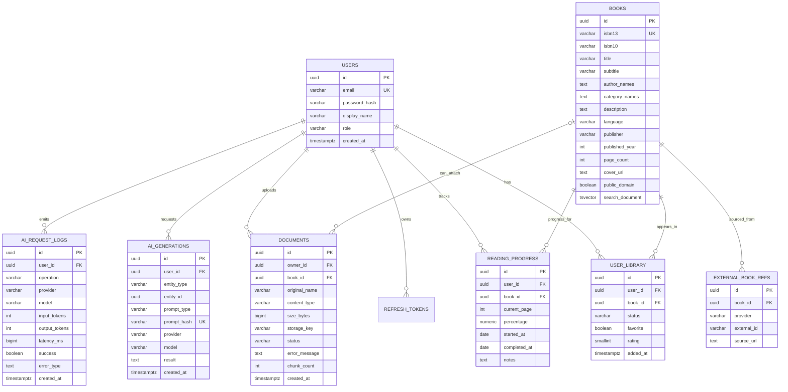

# Domain Model and Database

## ERD



## Vector storage

MVP uses Spring AI's PostgreSQL vector store table rather than separate physical vector tables per feature.

Each vector row includes metadata such as:

```json
{
  "type": "document_chunk",
  "ownerId": "uuid",
  "documentId": "uuid",
  "bookId": "uuid-or-null",
  "chunkIndex": 12,
  "sourceName": "clean-architecture.pdf"
}
```

Book metadata vectors use `type=book` and `bookId`. This keeps infrastructure small while allowing portable Spring AI filter expressions.

### Why not a generic Embedding JPA entity?

The vector store already owns persistence/index semantics. Duplicating vectors into a JPA entity would create two sources of truth. Domain tables store business data; `vector_store` stores retrieval documents.

## Important indexes

- `users(email)` unique.
- `books(isbn13)` unique where not null.
- `external_book_refs(provider, external_id)` unique.
- `user_library(user_id, book_id)` unique.
- `reading_progress(user_id, book_id)` unique.
- `books.search_document` GIN.
- `vector_store.embedding` HNSW cosine index.
- JSON metadata GIN index for vector metadata filters.
