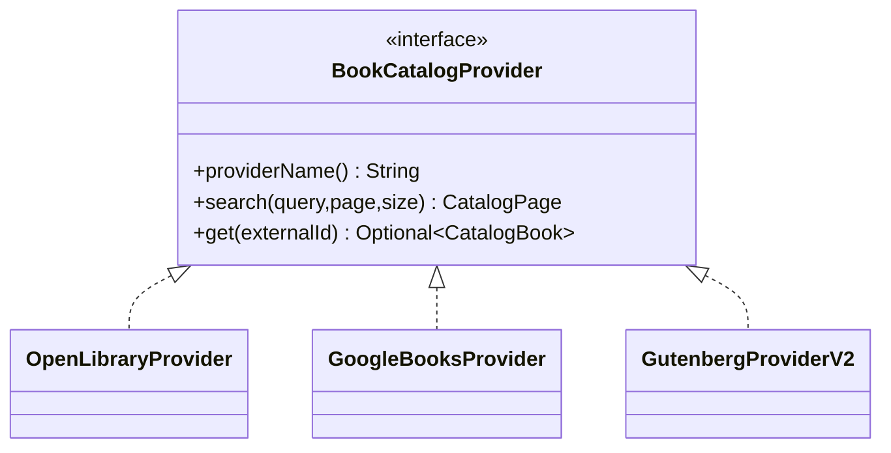

# External Catalog Integrations

## Open Library — primary MVP provider

Use cases:

- Search API: `https://openlibrary.org/search.json`
- Work/Edition/ISBN lookup for details when necessary.
- Covers served directly from `covers.openlibrary.org` rather than proxied through this backend.

Important operational rules:

- Use low-volume real-time discovery, not bulk harvesting.
- Send an identifying `User-Agent` with contact information.
- Cache useful normalized results locally only when users interact with them.
- Prefer one batched Search API call over many per-book lookups.

Current documented request limits (verified 2026-09-29): 1 request/sec for unidentified clients and 3 requests/sec for identified clients. Cover requests by identifiers other than CoverID/OLID have a separate documented limit of 100 requests/IP per 5 minutes.

## Google Books — optional fallback

The Volumes API supports:

- query search;
- direct volume lookup;
- title/authors/publisher/published date;
- industry identifiers such as ISBN;
- descriptions;
- page count;
- categories;
- language;
- image links and preview/info links.

An API key is recommended for quota/accounting. The implementation is disabled when `GOOGLE_BOOKS_API_KEY` is empty.

## Project Gutenberg — V2 full-text/public-domain path

Do not crawl HTML pages. Gutenberg publishes:

- OPDS feeds intended for applications;
- daily machine-readable catalog metadata (RDF/CSV);
- public-domain eBook files according to its terms and jurisdictional notices.

The MVP documents the adapter boundary but does not continuously mirror the catalog. A V2 importer can use OPDS for interactive browsing or a scheduled metadata snapshot for a self-hosted index.

## Groq — chat model provider

Chat, structured output and tool calling go to Groq through its OpenAI-compatible API
(`spring.ai.model.chat=openai`, `GROQ_BASE_URL=https://api.groq.com/openai/v1`). Groq has no embeddings API, so
embeddings run locally (see [06-spring-ai-rag.md](06-spring-ai-rag.md) and
[ADR-004](decisions/ADR-004-groq-chat-local-embeddings.md)).

| Tier | Default model | Used by |
|---|---|---|
| `FAST` | `openai/gpt-oss-20b` (`AI_MODEL_FAST`) | book summaries, first discovery attempt |
| `SMART` | `openai/gpt-oss-120b` (`AI_MODEL_SMART`) | RAG answers, assistant tool calling, discovery retry |

Limits on our side (free-tier friendly, both configurable):

- per user: `AI_RATE_LIMIT_PER_MINUTE` (default 20);
- whole instance: `AI_GLOBAL_RATE_PER_MINUTE` (default 25), kept under Groq's free-tier requests/minute.

Timeout is `AI_TIMEOUT` (default 45 s) with one SDK retry. `AiFacade` maps provider failures to stable API errors:

| Provider failure | API error |
|---|---|
| HTTP 429 / rate-limit exception | `429 AI_RATE_LIMITED` |
| socket/HTTP timeout | `504 AI_TIMEOUT` |
| anything else | `502 AI_PROVIDER_ERROR` |
| `AI_ENABLED=false` | `503 AI_DISABLED` (no call is made) |

Every call, success or failure, writes an `ai_request_logs` row with the model actually used, token counts and
latency, in its own transaction.

## Provider abstraction

## Deduplication

Priority:

1. normalized ISBN-13;
2. normalized ISBN-10;
3. normalized `(title + first author)` fingerprint.

Provider IDs are never treated as globally unique because the same work can exist in multiple catalogs.
