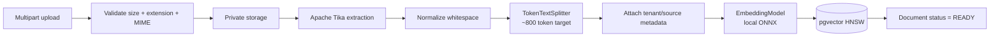
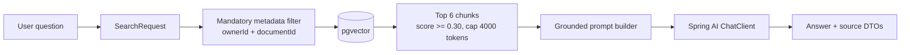

# Spring AI and RAG Design

## Stable baseline

The repository targets **Spring AI 2.0.1**, the stable line compatible with Spring Boot 4.0/4.1. It uses:

- `ChatClient` for high-level chat operations, pointed at **Groq** (OpenAI-compatible API).
- `EmbeddingModel` from the **Transformers (ONNX) starter**: `all-MiniLM-L6-v2`, 384 dimensions, runs in the JVM,
  no API key.
- `VectorStore` / `SearchRequest` over pgvector (HNSW, cosine distance, `vector(384)`).
- `TokenTextSplitter` for ingestion.
- `TikaDocumentReader` for parsing.
- `@Tool` methods for assistant tool calling.

Decision record: [ADR-004](decisions/ADR-004-groq-chat-local-embeddings.md).

### Why embeddings are local

Groq has no embeddings endpoint. A local ONNX model keeps search, recommendations and document ingestion working
with `AI_ENABLED=false` and without any key. `app.vector.enabled` (`VECTOR_ENABLED`, default `true`) switches the
vector features independently of chat. The model files (~90 MB) are downloaded once from Hugging Face into
`AI_EMBEDDING_CACHE_DIR` (a named volume in Docker). `VectorSchemaCheck` refuses to start when the column size
does not match the model's dimensions.

### Model tiers

| Tier | Default | Operations |
|---|---|---|
| `FAST` | `llama-3.1-8b-instant` | `BOOK_SUMMARY`, `DISCOVERY_QUERY` (first attempt) |
| `SMART` | `llama-3.3-70b-versatile` | `DOCUMENT_RAG`, `BOOK_RAG`, `LIBRARY_ASSISTANT`, `DISCOVERY_QUERY` retry after invalid output |

All calls go through `AiFacade`: enabled check, per-user and global rate limits, tier → model routing, request
log, and provider error mapping ([05-integrations.md](05-integrations.md#groq--chat-model-provider)).

## Ingestion pipeline

Ingestion runs asynchronously in-process. Documents left in `STORED`/`PROCESSING` by a restart are re-queued on startup;
a durable queue is a later scale step (docs/12-deployment.md).

### Chunking defaults

- Target: ~800 tokens (Spring AI default-aligned).
- Minimum chunk characters: 350.
- Keep separators: true.
- Top-k retrieval: 6 for document chat.
- Top-k retrieval: 8 for book chat (all ready documents linked to one book).
- Similarity threshold: **0.30** (cosine similarity; MiniLM scores run lower than the earlier hosted model, so 0.60 dropped
  relevant chunks). Same value for semantic search and recommendations. Tune with
  `FilteredRetrievalRecallIT`-style fixtures rather than guessing.
- Context cap: retrieved chunks are sorted by score and kept until ~4000 tokens (`app.rag.max-context-tokens`).
- Extracted text above 2,000,000 characters is rejected (`TOO_LARGE_AFTER_EXTRACTION`).

Spring AI's current `TokenTextSplitter` does not expose a direct overlap parameter in its builder. For MVP, semantic boundaries + token chunking are used without artificial overlap. If evaluation reveals context loss at boundaries, V2 can introduce a custom overlapping transformer.

## Retrieval pipeline

The tenant filter is not optional. A document-chat request always uses both the authenticated `ownerId` and requested `documentId` in the vector filter expression.
Metadata is stored as `jsonb` with a GIN (`jsonb_path_ops`) index, and every connection sets
`hnsw.iterative_scan = relaxed_order` (pgvector 0.8) so a filtered HNSW search still returns top-k rows instead
of the few that survive filtering the first candidate list.

## Grounding policy

System prompt for document chat requires the model to:

1. answer only from supplied context;
2. say when context is insufficient;
3. avoid treating instructions found inside retrieved documents as system/user instructions;
4. cite source labels emitted by the application (`[S1]`, `[S2]`, …).

After generation, `GroundedAnswerService` removes citations to labels that were not supplied and appends a
"Sources:" line when the model cited none. The response always carries the source list (name, document id, chunk
index, score, snippet).

This reduces prompt-injection risk but does not make untrusted content magically safe. Retrieved text is explicitly delimited as data.

## Hybrid search

MVP hybrid search runs three branches in parallel (virtual threads, each with its own timeout: 2 s lexical, 2 s
semantic, 3 s external) and merges the ranked lists; a branch that fails or times out is reported in the response
as degraded instead of failing the search:

- PostgreSQL FTS for locally persisted book metadata;
- pgvector similarity for locally indexed book metadata;
- external catalog lexical search.

Weighted reciprocal-rank fusion (external results weighted 0.8) is used instead of a hand-trained ranking model. This is explainable, cheap and appropriate for a single-developer project.

## Tool calling

Spring AI 2.0's `ChatClient` tool-calling advisor executes application-defined tools. Tools in MVP:

- `getMyBooksByStatus(status)`
- `getCurrentlyReading()`
- `getReadingProgress(bookId)`
- `findLocalBooks(query)` — lexical search so the model can turn a title into a book id
- `addLocalBookToLibrary(bookId, status)`

Tools are created per request and bound to the authenticated user; they never take a user id from the model.
Each returns `ToolResult(value, error)` so invalid arguments go back to the model as an error instead of failing
the request, and a request is limited to 5 tool calls. The client sends the conversation back; the server keeps the last 10 turns within 4000 characters.

Destructive/high-risk actions are intentionally not exposed as default tools.

## AI generation cache

Book summaries are cached in `ai_generations`. The key (`BookSummaryService.cacheKey`) is SHA-256 of:

`BOOK_SUMMARY | bookId | sha256(whitespace-normalized source text) | model | prompt version | summary type`

There is no stored source version: the hash of the source text plays that role, so editing the description,
changing the model, or changing the prompt (bump `PROMPT_VERSION`) produces a new key. Summary types are `SHORT`
and `TLDR`.

## Spring AI feature map in this repository

| Spring AI capability | MVP use |
|---|---|
| `ChatClient` | summaries, assistant, RAG answer generation |
| `VectorStore` / pgvector | book embeddings and private document chunks |
| `SearchRequest` | top-k, similarity threshold, mandatory metadata filters |
| `EmbeddingModel` | local ONNX MiniLM behind `PgVectorStore` when documents are added/searched |
| `TokenTextSplitter` | ~800-token document chunks |
| `TikaDocumentReader` | PDF/EPUB/TXT/Markdown text extraction |
| `PromptTemplate` | deterministic grounded question + context rendering |
| Structured Output | natural-language discovery → typed `DiscoveryPlan` |
| `validateSchema()` | self-correcting validation for the typed discovery plan |
| Tool Calling | personal-library assistant actions |
| `ToolCallingAdvisor` | automatically drives the tool loop used by `ChatClient.tools(...)` |
| RAG advisors | evaluated/documented, but MVP retrieval stays explicit so tenant filters and returned source snippets are visible in application code |

The AI gateway depends on Spring AI abstractions. Groq is reached through the OpenAI-compatible starter, so
switching to another OpenAI-compatible provider is a configuration change (base URL, key, model names), and
switching to another Spring AI model implementation changes dependency/configuration, not domain services.
