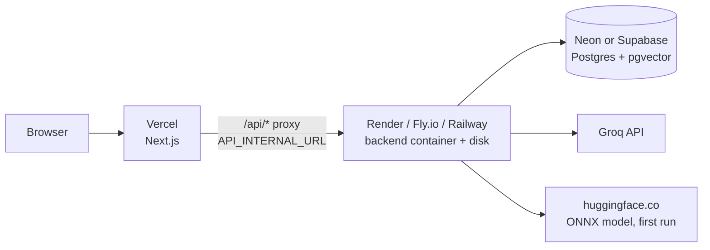

# Deployment path

## Local
`docker compose up --build` runs PostgreSQL/pgvector, Spring Boot and Next.js; it works without a `.env` file.
Postgres and the API bind to `127.0.0.1` only; the browser uses `http://localhost:3000`, and `/api/*` is proxied
by Next.js to the backend. Chat AI stays off until `AI_ENABLED=true` and `GROQ_API_KEY` are set; embeddings are
local and need no key. `docker-compose.dev.yml` starts only the database for running the apps from source.

## Environment per service

| Variable | Backend | Frontend | Local default | Production |
|---|:---:|:---:|---|---|
| `SPRING_PROFILES_ACTIVE` | ✅ | | — | `prod` |
| `SPRING_DATASOURCE_URL` / `_USERNAME` / `_PASSWORD` | ✅ | | compose Postgres | managed Postgres (with `?sslmode=require`) |
| `JWT_SECRET` | ✅ | | dev placeholder | **required**, `openssl rand -base64 48` (prod refuses the default) |
| `JWT_ACCESS_TTL_MINUTES` / `JWT_REFRESH_TTL_DAYS` | ✅ | | 15 / 30 | same |
| `APP_CORS_ORIGINS` | ✅ | | `http://localhost:3000` | frontend URL (only used if the browser calls the API directly) |
| `APP_ADMIN_EMAILS` | ✅ | | empty | your email |
| `AI_ENABLED`, `GROQ_API_KEY` | ✅ | | `false`, empty | `true`, secret |
| `GROQ_BASE_URL`, `AI_MODEL_FAST`, `AI_MODEL_SMART` | ✅ | | Groq defaults | same |
| `AI_RATE_LIMIT_PER_MINUTE`, `AI_GLOBAL_RATE_PER_MINUTE` | ✅ | | 20, 25 | tune to the Groq plan |
| `VECTOR_ENABLED`, `AI_EMBEDDING_DIMENSIONS` | ✅ | | `true`, 384 | same |
| `AI_EMBEDDING_CACHE_DIR`, `DJL_CACHE_DIR` | ✅ | | `/data/onnx-cache` (volume) | persistent disk path |
| `APP_UPLOAD_DIR` | ✅ | | `/data/uploads` (volume) | persistent disk path |
| `SERVER_FORWARD_HEADERS_STRATEGY` | ✅ | | `none` | `framework` (prod default; trust the platform proxy) |
| `OPEN_LIBRARY_USER_AGENT` | ✅ | | placeholder contact | real contact email |
| `GOOGLE_BOOKS_API_KEY` | ✅ | | empty (provider off) | optional |
| `API_INTERNAL_URL` | | ✅ runtime | `http://backend:8080` | backend public/private URL |
| `NEXT_PUBLIC_API_URL` | | ✅ build time | empty | leave empty (use the proxy) |

`API_INTERNAL_URL` is read by `src/proxy.ts` on every request, so the same frontend image works in any
environment. `NEXT_PUBLIC_API_URL` is inlined into the browser bundle **at build time**; set it only to make the
browser call a remote API directly, and then also add that origin to `APP_CORS_ORIGINS` (the CSP `connect-src`
picks it up at build time too).

## Production profile (`SPRING_PROFILES_ACTIVE=prod`)
- Refuses to start with the default `JWT_SECRET`.
- ECS-structured JSON logs, no stack traces or messages in error responses.
- Actuator exposes only `health` (no details); OpenAPI/Swagger UI disabled.
- Trusts `X-Forwarded-*` so rate limits see the client IP.
- Flyway validates migrations on start; Hibernate only validates the schema.

## ONNX embedding cache
The embedding model (all-MiniLM-L6-v2, ~90 MB) and the tokenizer native library are downloaded on the first
embedding call and cached in `AI_EMBEDDING_CACHE_DIR` / `DJL_CACHE_DIR`. Put them on a persistent disk, otherwise
every restart downloads the model again and the first search after a deploy is slow. The host needs outbound
access to `huggingface.co`. Budget ~1 GB RAM for the backend container (JVM uses 75% of the container limit).

## First cloud deployment

One concrete path that stays within free/low-cost tiers and keeps the modular monolith:

1. **Database — Neon or Supabase.** Create a Postgres 16+ database and run `CREATE EXTENSION vector;` once if the
   platform requires it (V1 also tries). pgvector must be ≥ 0.8 for iterative HNSW scans; older versions work
   but filtered searches can return fewer results. V3 runs `ALTER DATABASE … SET hnsw.iterative_scan`; if the
   role may not alter the database, the Hikari `connection-init-sql` still sets it per connection.
2. **Backend — Render / Fly.io / Railway.** Deploy `backend/Dockerfile` as one instance with a persistent disk
   mounted at `/data` (`APP_UPLOAD_DIR=/data/uploads`, `AI_EMBEDDING_CACHE_DIR=/data/onnx-cache`,
   `DJL_CACHE_DIR=/data/onnx-cache/djl`). Health check: `/actuator/health/readiness`. Set the backend variables
   from the table above as secrets.
3. **Frontend — Vercel.** Import the repo with root directory `frontend`. Set `API_INTERNAL_URL` to the backend
   URL; leave `NEXT_PUBLIC_API_URL` empty. (The `frontend/Dockerfile` image works on any container host too.)
4. **Smoke test.** Register, add a book, upload a small PDF until `READY`, run a semantic search, then enable AI
   and ask the assistant a question.

Keep exactly one backend instance: rate limits are in memory, ingestion runs in-process, and uploads live on the
local disk.

## Scale triggers
Add infrastructure only after measurement:
- Object storage (S3-compatible): before running more than one backend instance, move uploads off the local disk.
- Redis: shared rate-limit counters for multiple instances; AI generation cache if read pressure justifies it.
- Queue: when ingestion jobs need durable retries/concurrency isolation (today, `STORED`/`PROCESSING` documents
  are re-queued on startup).
- Dedicated vector DB: only if pgvector capacity/latency is demonstrably insufficient.
- Microservices: only when independent deployment/team ownership becomes a real constraint.
